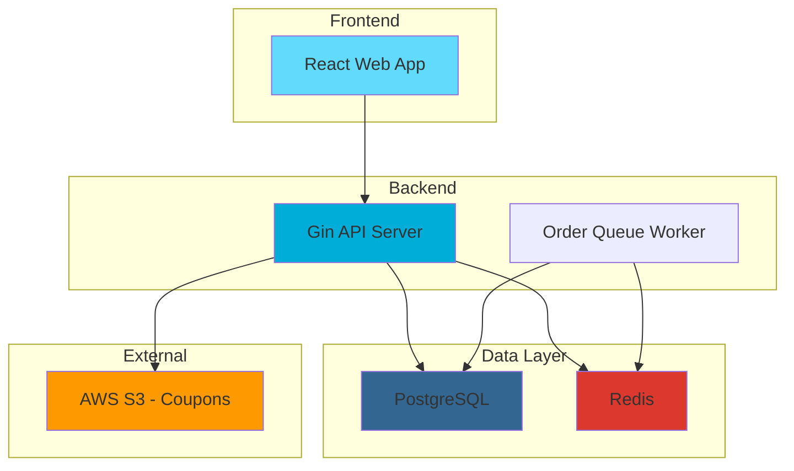

# 🍕 Oolio

<div align="center">


[](https://golang.org)
[](https://gin-gonic.com)
[](https://www.postgresql.org)
[](https://reactjs.org)
[](https://www.docker.com)
[](LICENSE)

**A modern, full-stack food ordering system** 🚀

*Built with Go backend, React frontend, and PostgreSQL database*

[📖 Documentation](#documentation) • [🚀 Quick Start](#-quick-start) • [🎯 Features](#-features) • [📚 API Reference](#-api-reference)

</div>

---

## 📋 Table of Contents

- [🌟 About](#-about)
- [🎯 Features](#-features)
- [🏗️ Architecture](#️-architecture)
- [🚀 Quick Start](#-quick-start)
- [📚 API Reference](#-api-reference)
- [🧪 Testing](#-testing)
- [🔧 Development](#-development)
- [🐳 Docker Deployment](#-docker-deployment)
- [📁 Project Structure](#-project-structure)
- [🤝 Contributing](#-contributing)
- [📄 License](#-license)

---

## 🌟 About

Oolio is a production-ready food ordering system that demonstrates modern full-stack development practices. It features a clean separation of concerns, comprehensive testing, containerized deployment, and scalable design patterns.

### 🎯 What Makes Oolio Special?

- **🔄 Asynchronous Order Processing**: Queue-based system for handling high-volume orders
- **🎫 Smart Coupon System**: Automated validation with S3 integration
- **🔐 Security First**: API key authentication, rate limiting, and CORS support
- **📊 Real-time Monitoring**: Health checks, structured logging, and metrics
- **🚀 Cloud Ready**: Docker containerization with horizontal scaling support

---

## 🎯 Features

### 🛒 Core Functionality
| Feature | Description | Status |
|---------|-------------|--------|
| **Product Catalog** | Browse menu items with categories, prices, and images | ✅ Complete |
| **Shopping Cart** | Add/remove items with quantity management | ✅ Complete |
| **Order Processing** | Place orders with async processing and status tracking | ✅ Complete |
| **Coupon System** | Validate promo codes with S3-based rule engine | ✅ Complete |
| **Order History** | View past orders and current status | ✅ Complete |

### 🔧 Technical Features
| Feature | Implementation | Details |
|---------|----------------|---------|
| **Authentication** | API Key-based | Middleware integration |
| **Rate Limiting** | Redis-based | 100 req/min (products), 50 req/min (orders) |
| **Database** | PostgreSQL 16 | UUID primary keys, proper indexing |
| **Caching** | Redis | Session management, rate limiting |
| **Background Jobs** | Queue Worker | Order processing with retry logic |
| **Health Monitoring** | Built-in endpoints | `/health`, database checks |

---

## 🏗️ Architecture

<div align="center">



</div>

### 🎨 Design Patterns
- **Repository Pattern**: Clean data access abstraction
- **Service Layer**: Business logic separation
- **Dependency Injection**: Uber FX for loose coupling
- **Middleware Pattern**: Cross-cutting concerns
- **Queue-Based Processing**: Asynchronous order handling

---

## 🚀 Quick Start

### 🎬 One-Command Setup (Recommended)

```bash
git clone <repository-url> && cd oolio && task docker-full-up
```

> 🎉 **That's it!** Your full-stack application is now running:
> - **Web UI**: http://localhost:3000
> - **API**: http://localhost:8080
> - **Health Check**: http://localhost:8080/health

### 📋 Prerequisites

| Tool | Version | Install Command |
|------|---------|-----------------|
| **Go** | 1.25.6+ | `brew install go` |
| **Docker** | 20.10+ | `brew install docker` |
| **Task** | Latest | `go install github.com/go-task/task/v3/cmd/task@latest` |

### 🔧 Manual Setup

<details>
<summary>Click to expand manual setup instructions</summary>

1. **Clone & Install Dependencies**
   ```bash
   git clone <repository-url>
   cd oolio
   task dev-setup
   ```

2. **Start Database Services**
   ```bash
   task docker-services-up
   ```

3. **Run Migrations**
   ```bash
   task migrate-up
   ```

4. **Start Application**
   ```bash
   task run
   ```

</details>

---

## 📚 API Reference

### 🔑 Authentication
Include your API key in the `X-API-Key` header:
```bash
curl -H "X-API-Key: apitest" http://localhost:8080/api/v1/order
```

### 📡 Endpoints

#### 🏥 Health Check
```http
GET /health
```
**Response**: Service status and health information

#### 📦 Products
```http
GET /api/v1/product          # List all products
GET /api/v1/product/{id}     # Get specific product
```
**Rate Limit**: 100 requests/minute

#### 🛒 Orders
```http
POST /api/v1/order           # Place new order
GET /api/v1/order/{id}       # Get order details
GET /api/v1/order            # List orders
```
**Rate Limit**: 50 requests/minute (requires API key)

#### 📊 Queue Status
```http
GET /api/v1/queue/status     # Processing queue status
```
**Rate Limit**: 30 requests/minute

### 💡 Example Usage

<details>
<summary>📖 Complete API Examples</summary>

```bash
# Health Check
curl http://localhost:8080/health

# List Products
curl http://localhost:8080/api/v1/product

# Get Specific Product
curl http://localhost:8080/api/v1/product/550e8400-e29b-41d4-a716-446655440000

# Place Order with Coupon
curl -X POST http://localhost:8080/api/v1/order \
  -H "X-API-Key: apitest" \
  -H "Content-Type: application/json" \
  -d '{
    "items": [
      {"productId": "550e8400-e29b-41d4-a716-446655440000", "quantity": 2}
    ],
    "couponCode": "HAPPYHRS"
  }'

# Check Order Status
curl -H "X-API-Key: apitest" \
  http://localhost:8080/api/v1/order/550e8400-e29b-41d4-a716-446655440000
```

</details>

---

## 🧪 Testing

### 🎯 Test Coverage
```bash
# Run all tests with coverage
task test-coverage

# Run specific test suites
task test-unit          # Unit tests
task test-integration   # Integration tests
task test-handler       # HTTP handler tests
```

### 📊 Test Structure
```
tests/
├── unit/           # Service and repository tests
├── integration/    # End-to-end API tests
├── handler/        # HTTP endpoint tests
└── e2e/           # Full application tests
```

### 🏆 Quality Assurance
- **Unit Tests**: 90%+ coverage target
- **Integration Tests**: API contract validation
- **Load Tests**: Performance benchmarking
- **Security Tests**: Authentication and authorization

---

## 🔧 Development

### 🛠️ Development Workflow

```bash
# Development with hot reload
task docker-dev-full-up

# Code quality checks
task fmt              # Format code
task lint             # Run linter
task sqlc-compile     # Generate SQL code

# Database management
task migrate-create add_new_table
task migrate-up
task migrate-down
```

### 📝 Code Standards
- **Go Formatting**: `gofmt` and `golangci-lint`
- **Commit Messages**: Conventional Commits
- **Documentation**: Go doc comments
- **Testing**: TDD approach with 90%+ coverage

### 🔄 Database Migrations

<details>
<summary>📖 Migration Best Practices</summary>

**Schema Migrations:**
```sql
-- Safe table creation
CREATE TABLE IF NOT EXISTS products (
    id UUID PRIMARY KEY DEFAULT gen_random_uuid(),
    -- ...
);
```

**Data Migrations:**
```sql
-- Safe data insertion
INSERT INTO products (name, price) 
SELECT 'Product Name', 99.99
WHERE NOT EXISTS (
    SELECT 1 FROM products 
    WHERE name = 'Product Name' AND price = 99.99
);
```

</details>

---

## 🐳 Docker Deployment

### 🚀 Production Deployment

```bash
# Full stack deployment
task docker-full-up

# Scale API service
docker-compose up -d --scale api=3

# View logs
task docker-full-logs
```

### 🛠️ Service Configuration

| Service | Port | Description |
|---------|------|-------------|
| **API** | 8080 | Go backend service |
| **Web** | 3000 | React frontend |
| **DB** | 5432 | PostgreSQL database |
| **Redis** | 6379 | Caching and rate limiting |

### 📊 Health Monitoring

```bash
# Application health
curl http://localhost:8080/health

# Database health
docker-compose exec db pg_isready -U oolio

# Service status
docker-compose ps
```

---

## 📁 Project Structure

```
oolio/
├── 📂 cmd/                    # Application entry point
│   └── 📄 main.go
├── 📂 internal/               # Private application code
│   ├── 📂 config/            # Configuration management
│   ├── 📂 database/          # Database setup & SQLC
│   ├── 📂 app/               # Application logic
│   │   ├── 📂 handler/       # HTTP handlers
│   │   ├── 📂 middleware/    # HTTP middleware
│   │   ├── 📂 models/        # Data models
│   │   ├── 📂 repository/    # Data access layer
│   │   ├── 📂 services/      # Business logic
│   │   ├── 📂 router/        # Route configuration
│   │   └── 📂 worker/        # Background jobs
│   └── 📂 fx/                # Dependency injection
├── 📂 migrations/             # Database migrations
├── 📂 tests/                  # Test suites
├── 📂 web/                    # React frontend
├── 📄 docker-compose.yml      # Production setup
├── 📄 Taskfile.yml            # Task runner
└── 📄 sqlc.yaml               # SQLC config
```

---

## 🤝 Contributing

We welcome contributions! 🎉

### 🚀 Getting Started

1. **Fork** the repository
2. **Create** a feature branch: `git checkout -b feature/amazing-feature`
3. **Commit** your changes: `git commit -m 'feat: add amazing feature'`
4. **Push** to the branch: `git push origin feature/amazing-feature`
5. **Open** a Pull Request

### 📋 Contribution Guidelines

- **Code Quality**: Run `task lint` before committing
- **Tests**: Ensure all tests pass with `task test`
- **Documentation**: Update README and API docs
- **Commits**: Follow [Conventional Commits](https://conventionalcommits.org/)

### 🏆 Recognition

Contributors will be recognized in:
- **README.md**: Contributors section
- **CHANGELOG.md**: Release notes
- **GitHub Stars**: Community appreciation

---

## 📄 License

This project is licensed under the MIT License - see the [LICENSE](LICENSE) file for details.

<div align="center">

**Made with ❤️ by the Oolio Team**

[🌟 Star this repo](https://github.com/your-username/oolio) • [🐛 Report Issues](https://github.com/your-username/oolio/issues) • [💬 Discussions](https://github.com/your-username/oolio/discussions)

</div>

---

## 🔗 Links

- **📖 Documentation**: [docs/](docs/)
- **🐳 Docker Guide**: [docs/DOCKER.md](docs/DOCKER.md)
- **🧪 Test Plan**: [test-cases/test-plan.md](test-cases/test-plan.md)
- **📊 API Examples**: [examples/](examples/)
- **🎯 Live Demo**: [https://demo.oolio.com](https://demo.oolio.com) *(Coming soon)*

---

<div align="center">


</div>